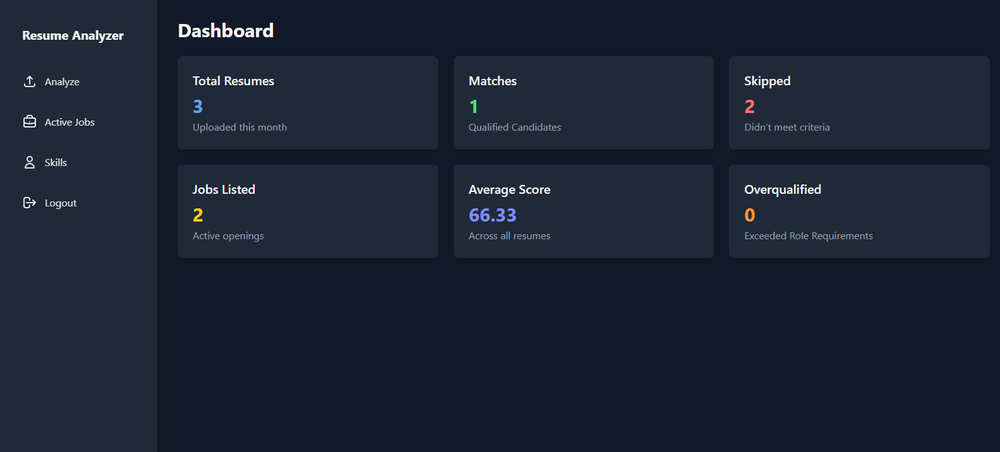
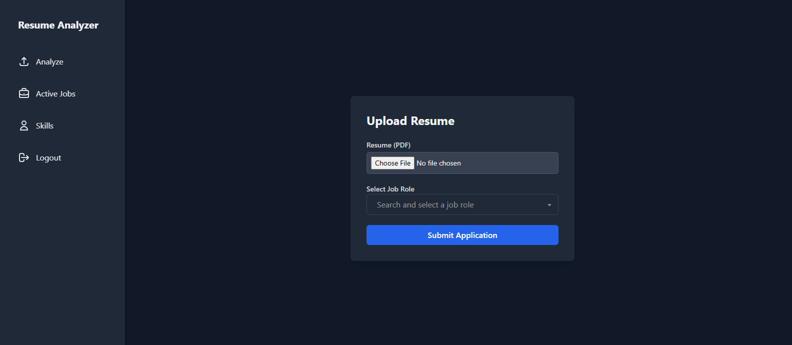
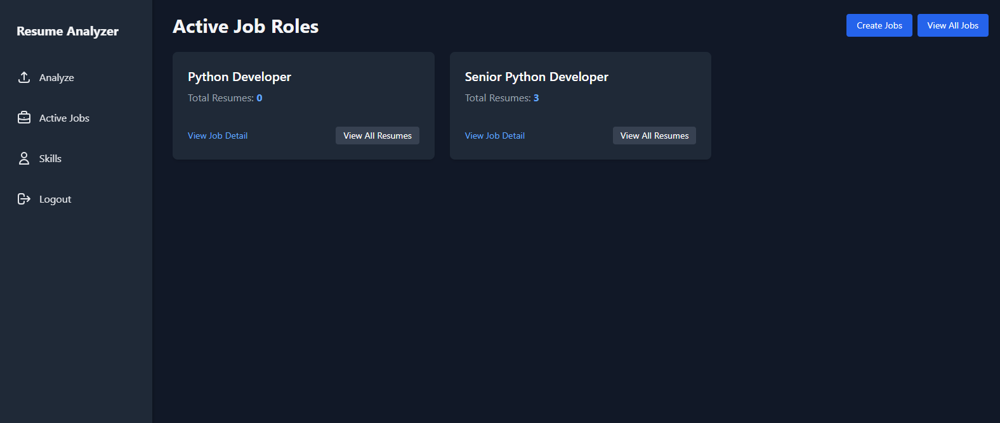
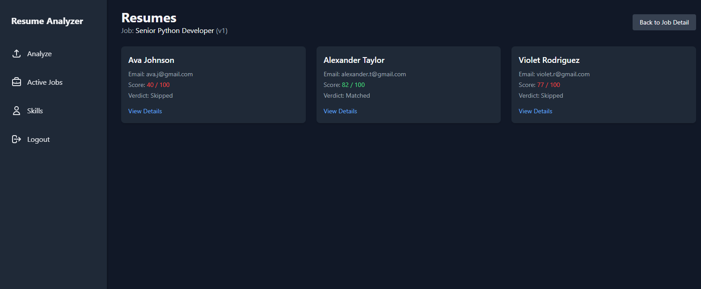
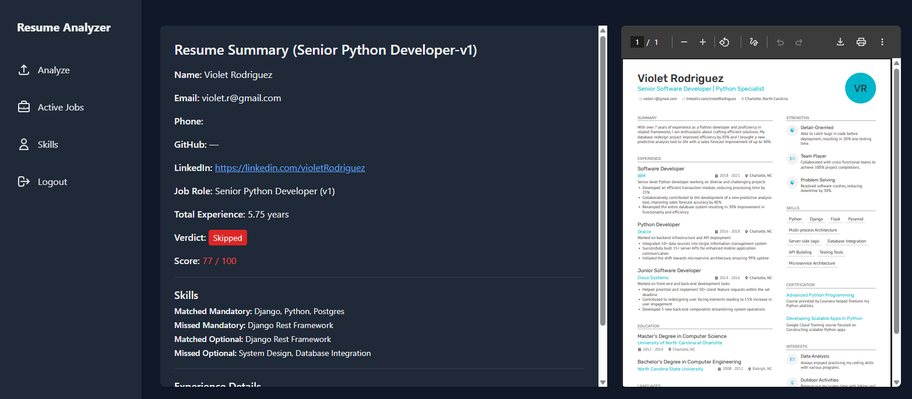
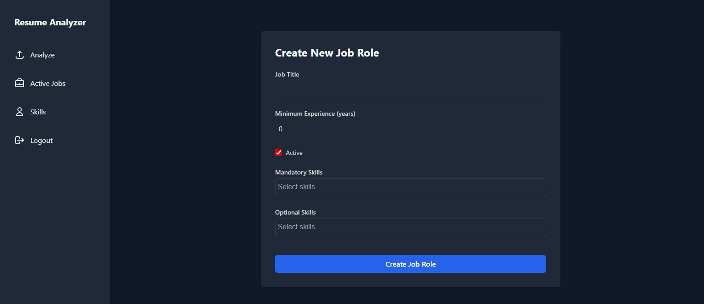
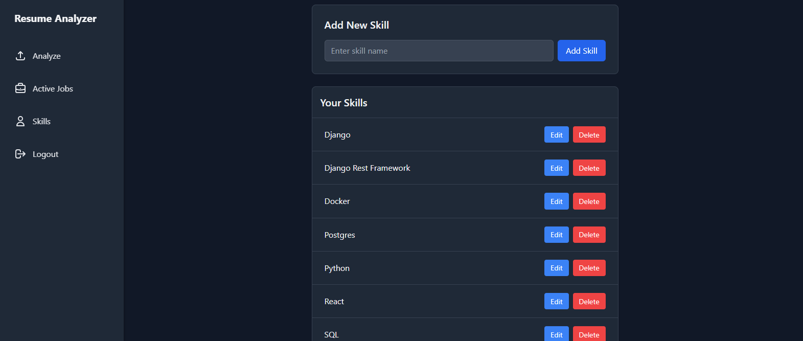
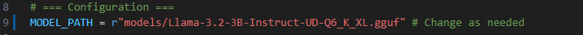

# 📄 Resume Analyzer

**Resume Analyzer** is a web application built with **Python** and **Django** that allows users to upload resumes and evaluate them against specific job roles. The analysis is powered by a **Large Language Model (LLM)** to extract relevant skills and experience from resumes.

---

## 🚀 Features

- 📤 Upload a **PDF Resume** and select a **Job Role**.
- 🤖 Analyze resumes using an **LLM** to extract:
  - Personal information
  - Skills (matched/missed)
  - Experience history and total experience
- 🎯 Compare extracted resume data with job role requirements:
  - Minimum experience
  - **Mandatory** and **Optional** skills
- 📈 Generate a **Resume Score** and **Verdict**:
  - `Matched`
  - `Skipped`
  - `Overqualified`
- 📝 Display original uploaded PDF alongside analysis
- 🔄 **Versioned Job Roles**: If a role with the same title is created again, it's saved as `v2`, `v3`, etc.
- 📚 Manage:
  - Job Roles (title, required experience, mandatory & optional skills)
  - Skills (by title)
  - Submitted resumes per job role, viewable individually

---

## 🖼️ Screenshots

<!-- ✅ Add screenshots or diagrams here -->
### 📤 Dashboard

### 📤 Resume Upload (Click Analyze)

### 📤 Active Jobs 

### 📤 Resumes (Click View All Resumes)

### 📤 Resume Details (Click View Details)

### 📤 Job Role Create (Active Jobs -> Create Jobs)

### 📤 Skills Add/Edit

---

## 🛠️ Tech Stack

- **Backend**: Python, Django
- **AI/ML**: LLM (for resume parsing and evaluation) using llama-cpp-python
- **Frontend**: Django Templates 
- **Database**: SQLite
---

## 🧪 Setup Instructions

Follow these steps to set up the project locally.

### Clone the Repository

If your project is already in an existing python3 virtualenv first install django by running

    $ git clone https://github.com/YeasinKabirJoy/resume_analyzer.git \
    cd resume_analyzer
    
      
### Create a Virtual Environment

    $ python -m virtualenv venv
    
### Activate the Virtual Environment
#### On Windows
    $ venv\Scripts\activate
#### on Mac/Linux
    $ source venv/bin/activate
    
### Install Dependencies
    $ pip install -r requirements.txt

### Download the LLM
https://huggingface.co/unsloth/Llama-3.2-3B-Instruct-GGUF/resolve/main/Llama-3.2-3B-Instruct-UD-Q6_K_XL.gguf?download=true

### Move to models Folder
Move the downloaded LLM to projects models folder.

If you want to use different model then change the following file.

     utils -> analyze.py 

Change the LLM model name

    
### Running the Project

#### Apply database migrations
    $ python manage.py makemigrations 
    $ python manage.py migrate
#### Run the development server
    $ python manage.py runserver
#### Open your browser and go to
   http://127.0.0.1:8000

## 📌 Future Improvements

- 🔐 User authentication  
- 📁 CSV export of results  
- 🤖 LLM fine-tuning for more accurate skill extraction  