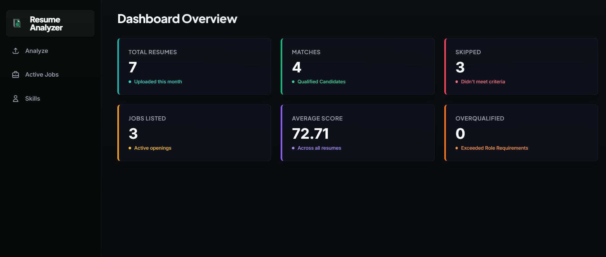
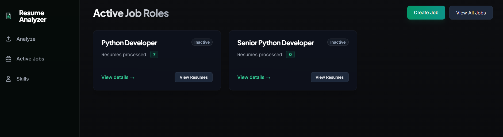
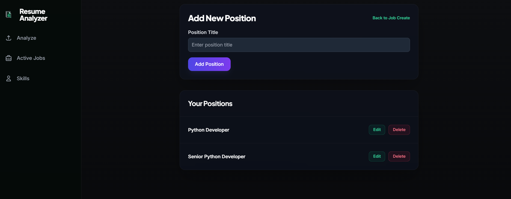
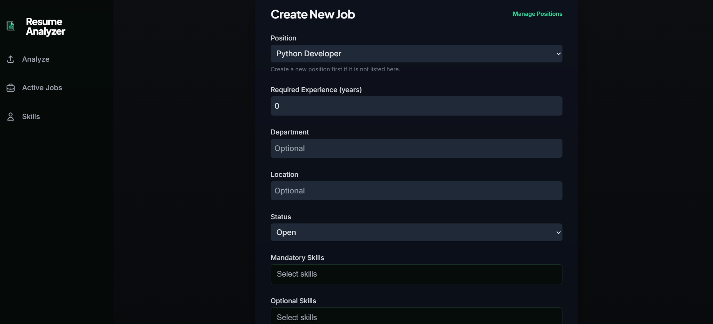
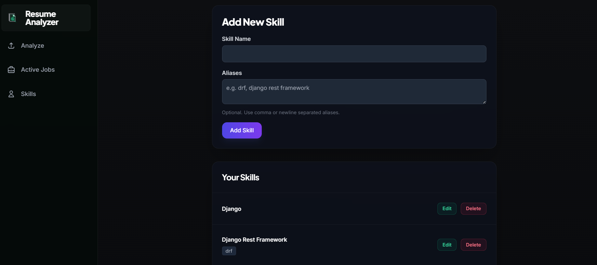
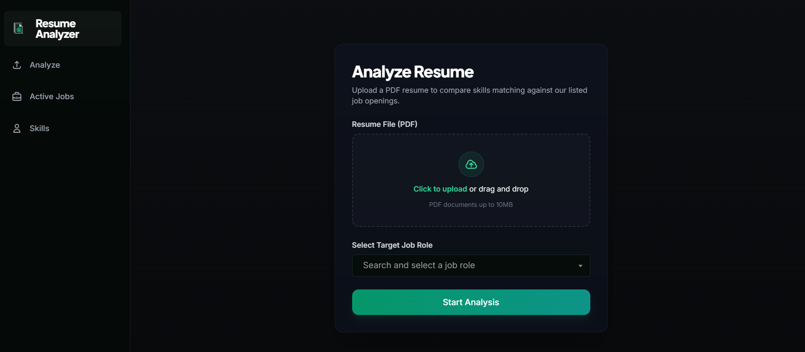
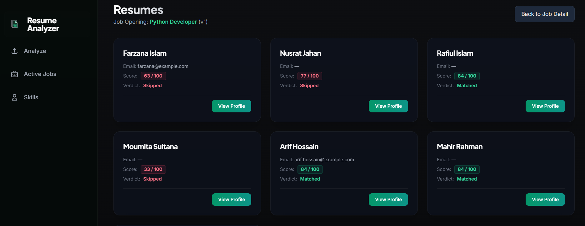
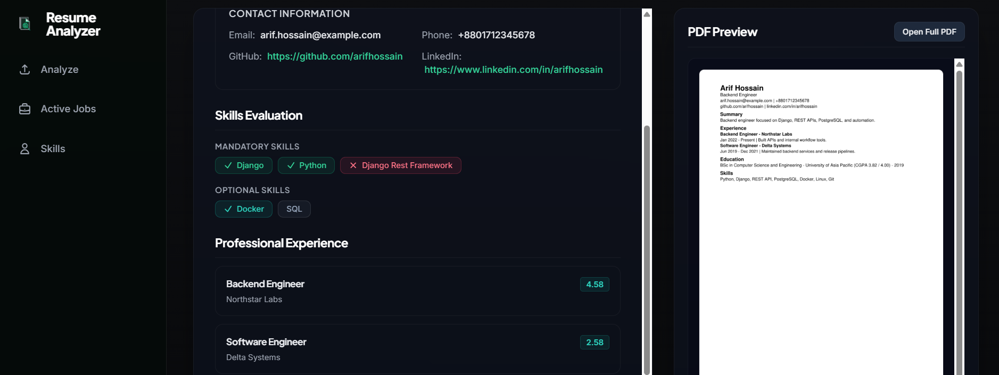

# Resume Analyzer

**Resume Analyzer** is a Django web application that evaluates ATS-style resumes against jobs using a hybrid local extraction pipeline. It combines lightweight NER with deterministic rules to parse structured resume data, then matches that data against position requirements.

---

## Features

- Upload a PDF resume and select a job
- Extract structured data locally from ATS-style resumes
  - Personal details
  - Experience history
  - Education history
  - Skills
- Use a hybrid extraction pipeline
  - NER-first for experience and education
  - Deterministic rules as fallback
  - Rules-based contact and skill matching
- Compare extracted resume data with job requirements
  - Minimum experience
  - Mandatory skills
  - Optional skills
- Generate a score and verdict
  - `matched`
  - `skipped`
  - `overqualified`
- Show resume analysis details and a PDF preview in the UI
- Support separate jobs with the same title
- Manage reusable positions, jobs, skills, and uploaded resumes from the dashboard and admin
- Create positions first, then build jobs from those positions

---

## Screenshots

### Dashboard



### Active Jobs


### Positions


### Job Create


### Skills Add/Edit


### Resume Upload


### Resumes


### Resume Details



---

## Tech Stack

- Backend: Python, Django
- Extraction: Lightweight local NER + deterministic rules
- Matching: Local rules-based scoring and role comparison
- Frontend: Django Templates
- Database: SQLite

---

## Setup Instructions

Follow these steps to set up the project locally.

### Clone the Repository

```bash
git clone https://github.com/YeasinKabirJoy/resume_analyzer.git
cd resume_analyzer
```

### Create a Virtual Environment

```bash
python -m virtualenv venv
```

### Activate the Virtual Environment

#### Windows
```bash
venv\Scripts\activate
```

#### Mac/Linux
```bash
source venv/bin/activate
```

### Install Dependencies

```bash
pip install -r requirements.txt
```

### Run the Project

#### Apply database migrations
```bash
python manage.py makemigrations
python manage.py migrate
```

#### Start the development server
```bash
python manage.py runserver
```

#### Open in your browser
```text
http://127.0.0.1:8000
```

---

## Model Behavior

- The local NER model is downloaded once on first use if it is not already present on the machine.
- After that, the saved model files are reused locally.
- Model weights are loaded when the server starts and then cached for the duration of the process.

---

## Future Improvements

- Add project extraction
- Improve contact extraction for more layouts
- Add user authentication
- Add CSV export of results
- Train and benchmark a domain-specific local model later
